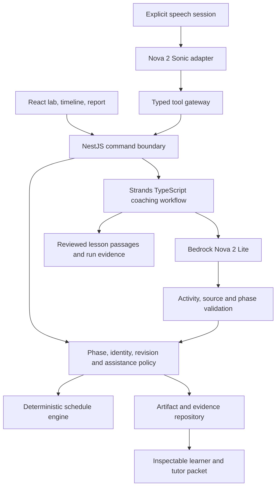

> **Historical R3 scope, superseded 2026-09-23:** the owner selected an operations-coordinator job simulation. Use the [current R4 plan](../career/TECHNICAL-CONTRACT.md). This file preserves earlier PowerLab scope/evidence and must not drive new feature work or be copied as the current submission story.

# Architecture — an observable learning workflow on AWS

Type: explanation. Revision 3, 2026-09-23. This is a target architecture. No R3 cloud resources or PowerLab code have been deployed.

## Existing foundation and reuse

React/Vite, NestJS, shared TypeScript contracts, SQLite, a Bedrock Converse adapter and a durable invocation ledger exist. The legacy quiz has dated verification evidence; the browser-only API mission preview has authored guidance and in-memory state. Reuse UI tokens, validation/provider patterns and persistence integrity concepts. Keep legacy quiz records and billing reservations separate from new lab events.

See [current status](../delivery/STATUS.md) and [historical evaluation](../delivery/LIVE-EVALUATION-2026-09-23.md). The known grading error is a reason for domain-owned outcomes, not evidence that the future coach is already reliable.

## Logical design

Local adapters use SQLite and a NestJS WebSocket bridge. Hosted adapters use DynamoDB for authoritative state. The phase machine is application code; neither a prompt nor an agent's conversation memory determines whether help is allowed or a task passed.

## Intended deployment

| Component | AWS target / implementation | Reason |
| --- | --- | --- |
| React static site | Private S3 origin + CloudFront | Fast browser entry and stable judge URL |
| NestJS HTTP handlers | Lambda + API Gateway HTTP API | Bounded commands, reports and coach requests; reuse domain services |
| Artifacts, receipts, guest capabilities, budget ledger | DynamoDB on-demand with conditional writes/transactions | Durable sessions, atomic revisions and isolation |
| Text coaching | Bedrock Nova 2 Lite, explicit model configuration | Read bounded action evidence and select an allowed intervention |
| Orchestration | Strands Agents TypeScript inside the server | Typed tool loop, explicit hooks and traceable execution; SDK is not a separately hosted service |
| Speech stream | Nova 2 Sonic through a small Node bridge on AgentCore Runtime | Long-lived bidirectional audio and tool events outside short HTTP request handlers |
| Deployment/support | CDK, IAM roles, ECR if container packaging, short-retention CloudWatch logs | Reproducible stack, restricted access and evidence for failures |

DynamoDB is the factual memory for the release. AgentCore Memory is optional and deferred until a need for generated cross-session summaries is demonstrated. Adding it solely to enlarge a service list is not part of the plan. A vector database, arbitrary code execution, multi-agent swarm and always-on NAT infrastructure are unnecessary for one reviewed pack.

## Voice is a separate transport

[AgentCore Runtime supports authenticated WebSocket connections](https://docs.aws.amazon.com/bedrock-agentcore/latest/devguide/runtime-get-started-websocket.html). The bridge must implement its service contract, including the `/ws` endpoint on port 8080. A hosted HTTP Lambda is not treated as a persistent speech socket.

A browser obtains a short-lived connection ticket from the authenticated application boundary. Prefer a server-created presigned connection URL plus a one-use application ticket bound to learner, session, allowed actions and expiry. The bridge validates the application ticket before accepting audio or tools. Never send AWS account credentials to the browser. Ticket replay, cross-session reuse, disconnect and quota enforcement are early feasibility checks.

Voice tools call the same domain commands as the UI, through an IAM-authenticated internal invocation or a scoped service boundary. Caller identity comes from validated session context, never from model-supplied parameters. Revalidate identity and phase in the receiving domain service.

[Strands feature documentation](https://strandsagents.com/docs/user-guide/sdk/quickstart/overview/) currently distinguishes Python and TypeScript capabilities; experimental bidirectional streaming is not listed for TypeScript. Therefore, do not promise that the TypeScript Strands layer supplies Sonic streaming. Use the AWS SDK bidirectional API directly for speech, with Strands responsible for text coaching. Confirm package/API compatibility during R06.

## Model and region choices

- Preserve the historical Sydney adapter and ledger metadata; no migration rewrites past calls.
- R3 target region: `us-east-1`, subject to account/latency verification, because the proposed speech/runtime services can be evaluated there together.
- Text candidate: `global.amazon.nova-2-lite-v1:0` with bounded context and explicit reasoning/output settings. Global inference is not a promise of regional data residency.
- Speech candidate: `amazon.nova-2-sonic-v1:0`, direct regional bidirectional endpoint. Current official [regional table](https://docs.aws.amazon.com/bedrock/latest/userguide/models-region-compatibility.html) includes N. Virginia, Oregon, Stockholm and Tokyo for Sonic; Sydney is not listed for it.
- English voice release. The [model documentation](https://docs.aws.amazon.com/bedrock/latest/userguide/model-card-amazon-nova-2-sonic.html) and service card must be rechecked before any additional language claim.

## Where AI is necessary and where it is not

| Function | Owner | Boundary |
| --- | --- | --- |
| Interpret an utterance and refer to the current lab | Sonic / input adapter | Specific requested action; clarify ambiguity |
| Choose a relevant experiment and concise explanation | Strands + Lite | Approved catalog and source/run IDs only |
| Calculate feasibility, power and energy | Pure TypeScript domain engine | No model arithmetic or generated executable code |
| Commit an edit, record help, decide phase | Domain service + repository | Validated identity, idempotency and expected revision |
| Restore factual context | Repository | Model cannot override saved facts |
| Summarize the packet | Deterministic template; optional bounded prose | All claims trace to receipts; no proficiency certification |

## Reliability and migration

Keep lab routes/data versioned separately from `/mission-preview` and legacy quiz endpoints. Start with a local deterministic vertical slice. Move the same domain contract to cloud adapters after behavior is understandable. Use append-only run/help events, immutable pack versions, atomic writes and durable inference reservations.

Cap every model loop, socket duration and context size. A timeout cannot manufacture a successful result. Agent results arriving after a revision/phase change must be revalidated or rejected as stale. Do not silently retry paid requests. Streaming audio usage needs its own reservation/cap model rather than pretending one socket equals one fixed-price call.

The [data contract](DATA-AND-API.md), [agent policy](AGENT-BEHAVIOR.md), [cost plan](AWS-AND-COSTS.md) and [security model](SECURITY-AND-PRIVACY.md) are implementation inputs. Hosted audio authentication is a high-risk early spike, not a last-week integration.

Independent-mode transport rule: the voice bridge suppresses generated tutor audio/text and accepts only explicit control commands plus deterministic result acknowledgments. Conceptual help changes the persisted phase before any teaching content is forwarded. See [agent policy](AGENT-BEHAVIOR.md); prompt-only suppression is insufficient.
